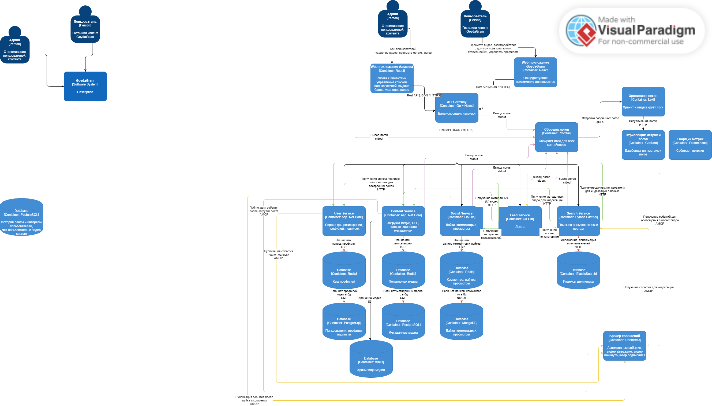

# GoydaGram 🎬

> **Full-featured video platform** on a microservices architecture

[](https://dotnet.microsoft.com/)
[](https://golang.org/)
[](https://python.org/)
[](https://postgresql.org/)
[](https://redis.io/)
[](https://rabbitmq.com/)
[](https://min.io/)
[](https://elastic.co/)
[](https://docker.com/)
[](LICENSE)

---

## 📋 Table of Contents

- [Project Overview](#-project-overview)
- [Key Features](#-key-features)
- [Architecture](#-architecture)
- [Technology Stack](#-technology-stack)
- [Quick Start](#-quick-start)
- [Development](#-development)
- [Team](#-team)
- [License](#-license)

---

## 🎯 Project Overview

**GoydaGram** is a modern video hosting platform built with microservices architecture. Inspired by popular video platforms, it implements the complete video lifecycle: from upload and transcoding to delivery via adaptive streaming (HLS).

<!-- **Live Demo:** [https://demo.goydagram.com](https://demo.goydagram.com)
**Documentation:** [https://docs.goydagram.com](https://docs.goydagram.com) -->

---

## ✨ Key Features

- 🎥 **Video Upload** with support for large files
- 🔄 **Automatic Transcoding** to HLS with multiple bitrates
- 👤 **User System** with JWT authentication and Refresh tokens
- ❤️ **Social Interaction**: likes, comments, views
- 📱 **Personalized Feed** based on user interests
- 🔍 **Full-Text Search** across videos and users
- 🏷️ **Tags and Recommendations** using tags-based scoring
- 📊 **Metrics & Monitoring** (Prometheus + Grafana)
- 🔒 **Admin Panel** for content moderation

---

## 🏗 Architecture



### Communication Patterns

**Synchronous (HTTP/REST):**

- Gateway → All services (proxying)
- Feed → User, Content, Social, Search (aggregation)
- Search → Content, User, Social (indexing)

**Asynchronous (RabbitMQ):**

- `video.events`: uploaded → processed → delivered
- `social.events`: liked → viewed → commented
- `user.events`: registered → subscribed

---

## 🛠 Technology Stack

| Service                   | Technologies                        | Version |
| ------------------------- | ----------------------------------- | ------- |
| **API Gateway**     | .NET 8, YARP, Serilog, Prometheus   | 8.0     |
| **User Service**    | .NET 8, EF Core, MediatR, BCrypt    | 8.0     |
| **Content Service** | .NET 8, FFmpeg, MinIO, MediatR      | 8.0     |
| **Social Service**  | Go 1.25, Gin, MongoDB, Redis        | 1.25    |
| **Feed Service**    | Go 1.25, Gin, Swagger               | 1.25    |
| **Search Service**  | Python 3.12, FastAPI, Elasticsearch | 3.12    |

### Infrastructure

| Component               | Purpose                            | Version |
| ----------------------- | ---------------------------------- | ------- |
| **PostgreSQL**    | Primary data (users, videos)       | 16      |
| **Redis**         | Caching (users, trends, sessions)  | 7.2     |
| **MongoDB**       | Social data (likes, comments)      | 6.0     |
| **Elasticsearch** | Search index (videos, users)       | 8.11    |
| **MinIO**         | S3 storage (videos, HLS, previews) | RELEASE |
| **RabbitMQ**      | Event Bus (async communication)    | 3.12    |

---

## 🚀 Quick Start

### Prerequisites

- Docker 24.0+
- Docker Compose 2.20+
- Git 2.40+
- 16GB+ RAM, 4+ CPU cores

### Installation

```bash
# Clone repository
git clone https://github.com/Undefned/GoydaGram
cd GoydaGram

# Copy environment variables
cp .env.example .env

# Start all services
docker-compose up -d

# Check health
curl http://localhost:8080/health

# Create test user
curl -X POST http://localhost:8080/api/auth/register \
  -H "Content-Type: application/json" \
  -d '{
    "username": "testuser",
    "email": "test@example.com",
    "password": "Test123!"
  }'
```

---

### Authentication Flow

1. Register or Login to get `accessToken` and `refreshToken`
2. Include `accessToken` in all requests: `Authorization: Bearer {token}`
3. When token expires, use `/api/auth/refresh` with `refreshToken`
4. Old refresh tokens are **revoked** on each refresh (rotation)

## 💻 Development

### Local Development

```bash
# .NET services
cd src/Services/UserService
dotnet restore && dotnet run --urls="http://localhost:5001"

# Go services
cd src/Services/SocialService
go mod download && go run main.go

# Python service
cd src/Services/SearchService
python -m venv venv && source venv/bin/activate
pip install -r requirements.txt
uvicorn main:app --reload --port 8000
```

### Running Tests

```bash
# .NET
dotnet test src/Services/UserService/UserService.Tests/

# Go
cd src/Services/SocialService && go test ./...

# Python
cd src/Services/SearchService && pytest tests/
```

---

## 👥 Team

- **Architect**: [Undefned](https://github.com/Undefned) & [DocUp](https://github.com/DocUp1)
- **Backend**: [Undefned](https://github.com/Undefned)
- **Frontend**: [soniksx](https://github.com/soniksx) & [Undefned](https://github.com/Undefned)
- **DevOps**: [Undefned](https://github.com/Undefned)

---

## 📄 License

This project is licensed under the MIT License - see the [LICENSE](LICENSE) file for details.

---

## 🤝 Contributing

We welcome contributions!

---

## 📞 Contact

- **Email**: ddenis22072006@gmail.com
- **GitHub**: https://github.com/Undefned/GoydaGram

---

**Made with ❤️ by GoydaGram Team**

**⭐ Star this repository if you like it!**
